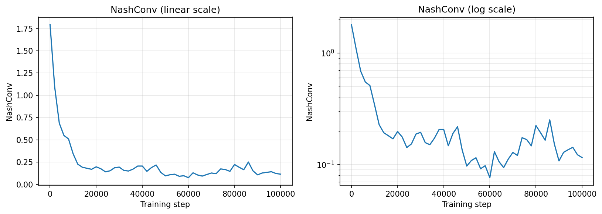
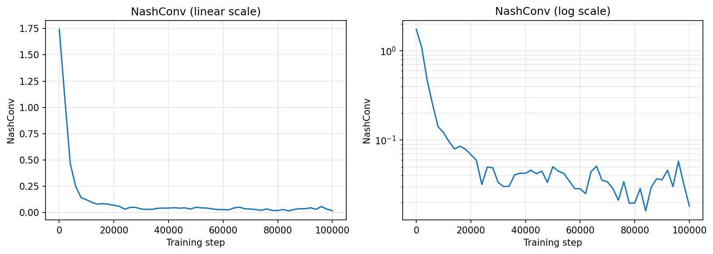
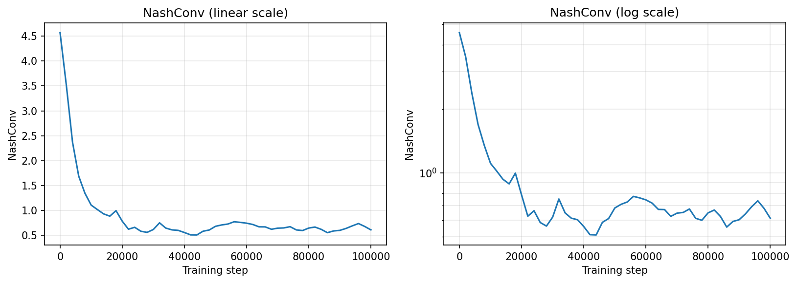
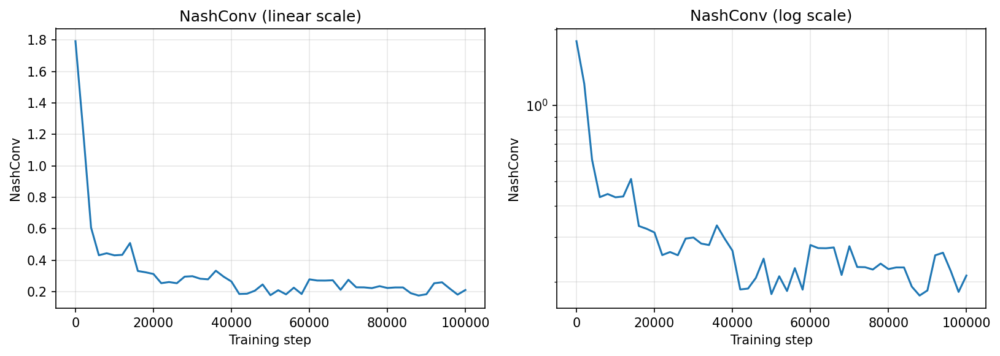
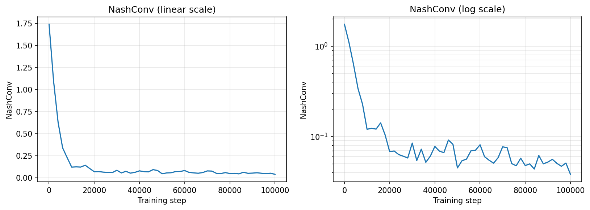
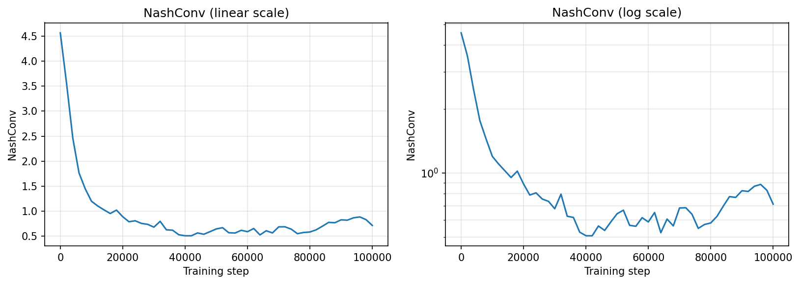

# rlg — Reinforcement Learning for Games

JAX-native multi-agent RL library targeting two-player zero-sum games (for now). 

Policy-gradient algorithms in games are currently state-of-the-art in large imperfect information two-player games. However, these algorithms are heavily dependent on the correct implementation and hyperparameter settings, which is often folk-knowledge.

Goal of this library is to provide unified framework to test and evaluate these algorithms. Following [Percy Liang's](https://cs.stanford.edu/~pliang/) talk at ICLR2026, we would like to share all experimental results within this repository, for others to reuse the knowledge without having to burn their own hardware.

This library is not compatible (yet) with some other great libraries dealing with similar topic, namely:

[OpenSpiel](https://github.com/google-deepmind/open_spiel) - Deepmind library for game-playing, that includes many game domains and both tabular and RL algorithms. The library combines C++ environments with C++/Python algorithms, which often becomes a bottleneck that RLG is trying to address by running both the environment and algorithm on single GPU.

[Exp-a-spiel](https://github.com/gabrfarina/exp-a-spiel) - Exploitability computation library for some medium-sized games, like Dark Hex and Phantom Tic-tac-toe.

[IIG-RL Benchmark](https://github.com/nathanlct/IIG-RL-Benchmark) - OpenSpiel and Exp-a-spiel compatible library, that was used to compare several game-playing algorithms.

[PGX](https://github.com/sotetsuk/pgx) - JAX native library containing many game environments. Closely related to RLG, but it seems not to be maintained anymore.

## Examples

Example NashConv for running both MMD and RNaD in small games with some default hyperparameters.

### MMD

| Goofspiel | Battleship | Leduc Hold'em |
|-|-|-|
|  |  |  |

### RNaD

| Goofspiel | Battleship | Leduc Hold'em |
|-|-|-|
|  |  |  |
